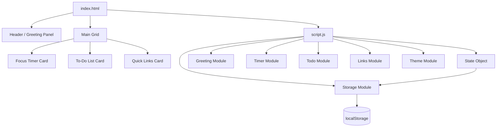

# Design Document: To-Do List Life Dashboard

## Overview

The To-Do List Life Dashboard is a single-page productivity application delivered as three static files (`index.html`, `css/style.css`, `js/script.js`) with no build tooling, no external dependencies, and no backend. All state is persisted via the browser's `localStorage` API.

The application presents four functional panels on a single page:

1. **Greeting Panel** — current time, date, time-based greeting, and a personalised user name.
2. **Focus Timer Panel** — a 25-minute countdown timer with Start, Stop, and Reset controls.
3. **To-Do List Panel** — task creation, inline editing, completion toggling, deletion, and duplicate prevention.
4. **Quick Links Panel** — save, open, and delete favourite website shortcuts.

Visual identity is built on a **Navy + Cream palette** with full Light Mode / Dark Mode support, persisted across sessions. The layout is a responsive dashboard grid: three content cards side-by-side on desktop (≥ 1024 px), stacked vertically on mobile.

---

## Architecture

### File Structure

```
project-root/
├── index.html          # Single HTML document — all markup
├── css/
│   └── style.css       # All styling — custom properties, layout, themes, components
├── js/
│   └── script.js       # All behaviour — state management, storage, UI rendering, event handling
└── .kiro/specs/todo-list-life-dashboard/
    ├── requirements.md
    ├── design.md
    └── tasks.md
```

### Execution Model

The browser loads `index.html`, which links `css/style.css` in `<head>` and `js/script.js` at the bottom of `<body>` with `defer`. On `DOMContentLoaded`, `script.js` executes its `init()` function, which:

1. Reads all four `localStorage` keys and hydrates in-memory state.
2. Applies the saved theme (or defaults to Light Mode).
3. Renders all four panels.
4. Attaches all event listeners.
5. Starts the clock tick interval (updates every 60 seconds).

There is no module bundler. All code lives in one IIFE or top-level scope within `script.js` to avoid global namespace pollution.

### Architectural Principles

- **Separation of concerns within one file**: `script.js` is organised into clearly labelled sections — State, Storage, Pure Helpers, Rendering, Event Handlers, and Init.
- **Unidirectional data flow**: user action → mutate state → persist to `localStorage` → re-render affected panel. No direct DOM mutation outside the render functions.
- **Pure helper functions**: all formatting, validation, and business-logic functions are pure (no side effects) so they are independently testable.
- **No framework**: no virtual DOM, no reactive bindings. Re-rendering a panel means rebuilding its dynamic content via `innerHTML` assignment or targeted DOM updates.

---

## Components and Interfaces

### Mermaid Component Diagram



### HTML Component Structure

```
<body data-theme="light|dark">
  <header class="site-header">
    <div class="greeting-panel">
      <div class="greeting-time" id="clock-display"></div>
      <div class="greeting-date" id="date-display"></div>
      <div class="greeting-text" id="greeting-display"></div>
      <form class="name-form" id="name-form">
        <input type="text" id="name-input" />
        <button type="submit">Save</button>
      </form>
    </div>
    <button class="theme-toggle" id="theme-toggle" aria-label="Toggle dark mode">
      <!-- sun/moon icon -->
    </button>
  </header>

  <main class="dashboard-grid">
    <section class="card card--timer" aria-label="Focus Timer">
      <h2>Focus Timer</h2>
      <div class="timer-display" id="timer-display">25:00</div>
      <div class="timer-controls">
        <button id="timer-start">Start</button>
        <button id="timer-stop">Stop</button>
        <button id="timer-reset">Reset</button>
      </div>
    </section>

    <section class="card card--todo" aria-label="To-Do List">
      <h2>Tasks</h2>
      <form class="todo-form" id="todo-form">
        <input type="text" id="todo-input" placeholder="Add a task…" />
        <button type="submit">Add</button>
      </form>
      <p class="error-msg" id="todo-error" role="alert" aria-live="polite"></p>
      <ul class="task-list" id="task-list"></ul>
    </section>

    <section class="card card--links" aria-label="Quick Links">
      <h2>Quick Links</h2>
      <form class="links-form" id="links-form">
        <input type="text" id="link-name-input" placeholder="Site name" />
        <input type="url"  id="link-url-input"  placeholder="https://…" />
        <button type="submit">Add</button>
      </form>
      <p class="error-msg" id="links-error" role="alert" aria-live="polite"></p>
      <div class="links-grid" id="links-grid"></div>
    </section>
  </main>
</body>
```

### CSS Architecture

**Custom Properties (Design Tokens)**

Defined on `:root` (Light Mode defaults), overridden on `[data-theme="dark"]`:

```css
:root {
  /* Colours — Light Mode */
  --color-bg:           #F5F0E8;   /* warm cream */
  --color-surface:      #FAF7F2;   /* off-white cards */
  --color-surface-alt:  #EDE8DF;   /* soft beige — borders, dividers */
  --color-primary:      #1B2A4A;   /* deep navy — primary buttons, headings */
  --color-primary-hover:#253B63;   /* navy hover state */
  --color-text:         #1B2A4A;   /* deep navy body text */
  --color-text-muted:   #6B7280;   /* muted labels */
  --color-accent:       #C9A96E;   /* warm gold — optional accent */
  --color-error:        #B94040;   /* muted red for errors */
  --color-success:      #3A7D5A;   /* muted green */

  /* Typography */
  --font-sans:    'Segoe UI', system-ui, -apple-system, sans-serif;
  --font-mono:    'Courier New', monospace;

  /* Spacing scale (rem) */
  --space-1: 0.25rem;
  --space-2: 0.5rem;
  --space-3: 0.75rem;
  --space-4: 1rem;
  --space-6: 1.5rem;
  --space-8: 2rem;

  /* Border radius */
  --radius-sm: 6px;
  --radius-md: 12px;
  --radius-lg: 20px;

  /* Shadows */
  --shadow-card: 0 2px 12px rgba(27, 42, 74, 0.08);
  --shadow-card-hover: 0 4px 20px rgba(27, 42, 74, 0.14);
}

[data-theme="dark"] {
  --color-bg:           #0F1B2D;   /* deep navy */
  --color-surface:      #1B2A4A;   /* slightly lighter navy */
  --color-surface-alt:  #253B63;   /* navy borders */
  --color-primary:      #E8E0D0;   /* cream — primary buttons in dark mode */
  --color-primary-hover:#F5F0E8;
  --color-text:         #E8E0D0;   /* cream body text */
  --color-text-muted:   #9CA3AF;
  --color-accent:       #C9A96E;
  --color-error:        #E57373;
  --color-success:      #66BB9A;
  --shadow-card: 0 2px 12px rgba(0, 0, 0, 0.3);
  --shadow-card-hover: 0 4px 20px rgba(0, 0, 0, 0.45);
}
```

**Layout — Responsive Grid**

```css
.dashboard-grid {
  display: grid;
  grid-template-columns: repeat(3, 1fr);
  gap: var(--space-6);
  padding: var(--space-6) var(--space-8);
}

/* Tablet */
@media (max-width: 1023px) {
  .dashboard-grid { grid-template-columns: repeat(2, 1fr); }
}

/* Mobile */
@media (max-width: 639px) {
  .dashboard-grid { grid-template-columns: 1fr; }
}
```

**Breakpoints**

| Breakpoint | Width      | Layout behaviour              |
|------------|------------|-------------------------------|
| Desktop    | ≥ 1024 px  | 3-column card grid            |
| Tablet     | 640–1023 px| 2-column grid (links wraps)   |
| Mobile     | < 640 px   | Single-column stacked cards   |

**CSS Class Naming Convention**: BEM-lite. Block (`card`, `task-item`, `link-chip`), modifier with `--` (`card--timer`, `task-item--completed`), element with `__` (`task-item__title`, `task-item__actions`).

### JavaScript Module Layout

`script.js` is structured in sequential sections within a self-contained scope:

```
1. STATE            — in-memory application state object
2. STORAGE          — read/write helpers for localStorage
3. HELPERS          — pure utility functions (formatting, validation, ID generation)
4. GREETING MODULE  — clock/date/greeting rendering
5. TIMER MODULE     — countdown logic and controls
6. TODO MODULE      — task CRUD, validation, rendering
7. LINKS MODULE     — link CRUD, validation, rendering
8. THEME MODULE     — toggle and apply theme
9. EVENT HANDLERS   — all addEventListener calls
10. INIT            — DOMContentLoaded bootstrap
```

**Public function signatures** (used across sections):

```js
// HELPERS
getGreeting(hour: number): string
formatTime(minutes: number, seconds: number): string
formatGreeting(greeting: string, name: string): string
normalizeTitle(str: string): string      // trim + lowercase
generateId(): string                     // crypto.randomUUID or Date.now fallback
isValidUrl(str: string): boolean

// TODO MODULE
addTask(title: string): void
editTask(id: string, newTitle: string): void
toggleTask(id: string): void
deleteTask(id: string): void
renderTasks(): void
isDuplicateTitle(title: string, excludeId?: string): boolean

// LINKS MODULE
addLink(name: string, url: string): void
deleteLink(id: string): void
renderLinks(): void

// TIMER MODULE
timerStart(): void
timerStop(): void
timerReset(): void
timerTick(): void
renderTimer(): void

// THEME MODULE
applyTheme(theme: 'light' | 'dark'): void
toggleTheme(): void

// STORAGE
loadState(): void
saveTasksToStorage(): void
saveLinksToStorage(): void
saveNameToStorage(name: string): void
saveThemeToStorage(theme: string): void
```

---

## Data Models

### In-Memory State Object

```js
const state = {
  tasks: [],          // Task[]
  links: [],          // Link[]
  customName: '',     // string
  theme: 'light',     // 'light' | 'dark'
  timer: {
    minutes: 25,
    seconds: 0,
    running: false,
    intervalId: null  // setInterval handle
  }
};
```

### Task Object

```js
{
  id:        string,    // unique identifier (crypto.randomUUID or Date.now-based)
  title:     string,    // raw user-supplied title (stored trimmed)
  status:    'active' | 'completed',
  createdAt: number     // Unix timestamp ms
}
```

### Link Object

```js
{
  id:    string,  // unique identifier
  name:  string,  // display label
  url:   string   // full URL including protocol
}
```

### localStorage Keys and Shapes

| Key          | Type       | Value shape                                       |
|--------------|------------|---------------------------------------------------|
| `tasks`      | JSON array | `Task[]` serialised with `JSON.stringify`         |
| `quickLinks` | JSON array | `Link[]` serialised with `JSON.stringify`         |
| `customName` | string     | raw string (user's name, or `""` if cleared)      |
| `theme`      | string     | `"light"` or `"dark"`                             |

Read on init via `JSON.parse` with a safe fallback:

```js
function loadState() {
  state.tasks      = JSON.parse(localStorage.getItem('tasks'))      ?? [];
  state.links      = JSON.parse(localStorage.getItem('quickLinks')) ?? [];
  state.customName = localStorage.getItem('customName')             ?? '';
  state.theme      = localStorage.getItem('theme')                  ?? 'light';
}
```

### Duplicate Detection

Normalisation: `str.trim().toLowerCase()`. A task title is a duplicate if `normalizeTitle(newTitle) === normalizeTitle(existingTask.title)` for any existing task. When editing, exclude the task being edited (by `id`) from the comparison.

---

## Correctness Properties

*A property is a characteristic or behavior that should hold true across all valid executions of a system — essentially, a formal statement about what the system should do. Properties serve as the bridge between human-readable specifications and machine-verifiable correctness guarantees.*

### Property 1: Greeting range — Morning

*For any* integer hour `h` where `5 ≤ h ≤ 11`, `getGreeting(h)` must return exactly `"Good Morning"`.

**Validates: Requirements 1.3**

---

### Property 2: Greeting range — Afternoon

*For any* integer hour `h` where `12 ≤ h ≤ 17`, `getGreeting(h)` must return exactly `"Good Afternoon"`.

**Validates: Requirements 1.4**

---

### Property 3: Greeting range — Evening

*For any* integer hour `h` where `18 ≤ h ≤ 20`, `getGreeting(h)` must return exactly `"Good Evening"`.

**Validates: Requirements 1.5**

---

### Property 4: Greeting range — Night

*For any* integer hour `h` where `h ∈ {21, 22, 23, 0, 1, 2, 3, 4}`, `getGreeting(h)` must return exactly `"Good Night"`.

**Validates: Requirements 1.6**

> *Note: Properties 1–4 together form a partition of the 24-hour clock. They can be consolidated into a single property test that generates any hour in [0, 23] and asserts the correct bucket — but are listed separately to map to individual acceptance criteria.*

---

### Property 5: Greeting format with name

*For any* non-empty string `name` and any greeting string `greeting`, `formatGreeting(greeting, name)` must return a string equal to `` `${greeting}, ${name}!` ``.

**Validates: Requirements 2.2**

---

### Property 6: Name persistence round-trip

*For any* non-empty string `name`, saving it via `saveNameToStorage(name)` and then reading `localStorage.getItem('customName')` must return the same string `name`.

**Validates: Requirements 2.3, 2.4**

---

### Property 7: Timer reset idempotency

*For any* timer state (any `minutes` ∈ [0, 25], any `seconds` ∈ [0, 59], `running` either true or false), calling `timerReset()` must produce a timer state of `{ minutes: 25, seconds: 0, running: false }`.

**Validates: Requirements 3.4**

---

### Property 8: Timer display format

*For any* `minutes` ∈ [0, 25] and `seconds` ∈ [0, 59], `formatTime(minutes, seconds)` must return a string matching the regular expression `/^\d{2}:\d{2}$/`.

**Validates: Requirements 3.6**

---

### Property 9: Adding a valid task grows the list

*For any* task list and any non-empty, non-duplicate title string, calling `addTask(title)` must increase `state.tasks.length` by exactly 1 and the new task must have `status === 'active'`.

**Validates: Requirements 4.2**

---

### Property 10: Whitespace-only titles are rejected

*For any* string `s` where `s.trim() === ''` (empty or all-whitespace), calling `addTask(s)` must leave `state.tasks` unchanged (same length and same contents).

**Validates: Requirements 4.3**

---

### Property 11: Task completion toggle is a round-trip

*For any* task currently in `state.tasks`, calling `toggleTask(id)` twice must return the task to its original `status` value.

**Validates: Requirements 4.5, 4.6**

---

### Property 12: Deleted task is no longer present

*For any* task ID `id` that exists in `state.tasks`, calling `deleteTask(id)` must result in a list where no element has `id === id`.

**Validates: Requirements 4.7**

---

### Property 13: Task list persistence round-trip

*For any* array of valid `Task` objects, serialising it to `localStorage['tasks']` via `saveTasksToStorage()` and then loading it via `loadState()` must produce a `state.tasks` array that deeply equals the original array.

**Validates: Requirements 4.9**

---

### Property 14: Duplicate task titles are always rejected

*For any* existing task title `T` in `state.tasks`, adding any string `s` where `s.trim().toLowerCase() === T.trim().toLowerCase()` must be rejected — `state.tasks` must remain unchanged.

**Validates: Requirements 5.1, 5.3**

---

### Property 15: Duplicate edit titles are always rejected

*For any* two distinct tasks A and B in `state.tasks`, calling `editTask(B.id, A.title)` (or any case/whitespace variant of `A.title`) must be rejected — `B.title` must remain unchanged.

**Validates: Requirements 5.4**

---

### Property 16: Adding a valid link grows the list

*For any* link list and any (non-empty `name`, valid `url`) pair, calling `addLink(name, url)` must increase `state.links.length` by exactly 1 and the new link must have the supplied `name` and `url`.

**Validates: Requirements 6.2**

---

### Property 17: Empty name or URL is rejected

*For any* pair `(name, url)` where `name.trim() === ''` or `url.trim() === ''`, calling `addLink(name, url)` must leave `state.links` unchanged.

**Validates: Requirements 6.3**

---

### Property 18: Deleted link is no longer present

*For any* link ID `id` that exists in `state.links`, calling `deleteLink(id)` must result in a list where no element has that `id`.

**Validates: Requirements 6.5**

---

### Property 19: Quick Links persistence round-trip

*For any* array of valid `Link` objects, serialising it to `localStorage['quickLinks']` via `saveLinksToStorage()` and then loading it via `loadState()` must produce a `state.links` array that deeply equals the original array.

**Validates: Requirements 6.7**

---

### Property 20: Theme toggle is a round-trip

*For any* theme value `T ∈ { 'light', 'dark' }`, calling `toggleTheme()` twice must leave `state.theme === T`.

**Validates: Requirements 7.2, 7.3**

---

### Property 21: Theme preference persistence round-trip

*For any* theme value `T ∈ { 'light', 'dark' }`, saving it via `saveThemeToStorage(T)` and loading via `loadState()` must set `state.theme === T`.

**Validates: Requirements 7.6, 7.7**

---

## Error Handling

### Validation Errors (User-Facing)

All validation errors display as inline messages adjacent to their form, using `aria-live="polite"` regions. They clear when the user starts typing a new value or successfully submits.

| Trigger | Element ID | Message |
|---|---|---|
| Empty task title | `#todo-error` | "Task title cannot be empty." |
| Whitespace-only task title | `#todo-error` | "Task title cannot be empty." |
| Duplicate task title (add) | `#todo-error` | "A task with that title already exists." |
| Duplicate task title (edit) | inline near edit field | "A task with that title already exists." |
| Empty link name | `#links-error` | "Please enter a site name." |
| Empty link URL | `#links-error` | "Please enter a URL." |

### localStorage Errors

`localStorage` access is wrapped in try/catch in all read and write helpers. If reading fails (corrupted JSON, quota exceeded, private browsing restriction), the helper returns the default empty value and logs a console warning — the app continues to function without persistence. No user-facing error is shown for storage failures (silent degradation).

```js
function safeRead(key, fallback) {
  try {
    const raw = localStorage.getItem(key);
    return raw !== null ? JSON.parse(raw) : fallback;
  } catch {
    console.warn(`[Dashboard] Could not read localStorage key "${key}"`);
    return fallback;
  }
}
```

### Timer Edge Cases

- **Start when already running**: no-op (guard: `if (state.timer.running) return`).
- **Stop when not running**: no-op.
- **Reset while running**: clears the interval, sets running to false, restores 25:00.
- **Tick reaching 00:00**: clears interval, sets `running: false`, renders `00:00`.

### URL Validation

URLs are validated with the `URL` constructor in a try/catch. A URL is valid if it can be parsed and has a protocol of `http:` or `https:`. Non-conforming inputs (bare hostnames, `javascript:` URIs, etc.) are rejected with the inline error.

```js
function isValidUrl(str) {
  try {
    const u = new URL(str);
    return u.protocol === 'http:' || u.protocol === 'https:';
  } catch {
    return false;
  }
}
```

---

## Testing Strategy

### Overview

This feature uses a **dual testing approach**: example-based unit tests for specific scenarios and edge cases, and property-based tests for universal correctness guarantees. All tests run in the browser or in a Node.js-compatible test environment (no build tools required — tests import functions via script module or a simple test harness).

**Recommended tooling**: [Vitest](https://vitest.dev/) for the test runner (zero-config, ESM-compatible) and [fast-check](https://fast-check.io/) for property-based testing.

---

### Unit Tests (Example-Based)

These tests cover specific scenarios, UI integration points, and edge cases.

**Greeting Panel**
- `getGreeting` returns correct string for boundary hours (0, 4, 5, 11, 12, 17, 18, 20, 21, 23).
- `formatGreeting` with a name produces `"Greeting, Name!"`.
- `formatGreeting` with empty name produces `"Greeting!"`.
- Clock updates: after 60 s mock interval, displayed time updates.

**Focus Timer**
- Initial state is `{ minutes: 25, seconds: 0, running: false }`.
- Each tick decrements seconds by 1.
- Tick at `00:01` produces `00:00` and stops the timer.
- Stop preserves remaining time.

**To-Do List**
- Adding a task renders it in the list.
- Empty title shows error message.
- Inline edit saves new title.
- Completed task receives `--completed` CSS class.
- Deleted task is removed from rendered list.

**Quick Links**
- Valid link renders as a clickable element.
- Empty name shows error.
- Empty URL shows error.
- Invalid URL (not http/https) shows error.
- Deleted link is removed from rendered list.

**Theme**
- Toggling sets `data-theme` attribute on `<body>`.
- Loading with saved `"dark"` applies dark theme.

---

### Property-Based Tests

Property-based tests use **fast-check** with a minimum of **100 iterations** per property. Each test is tagged with a comment referencing the design property it validates.

**Tag format**: `// Feature: todo-list-life-dashboard, Property {N}: {property_text}`

```js
// Example property test (fast-check syntax)

// Feature: todo-list-life-dashboard, Property 1–4: Greeting range correctness
test('getGreeting covers all 24 hours correctly', () => {
  fc.assert(
    fc.property(fc.integer({ min: 0, max: 23 }), (hour) => {
      const result = getGreeting(hour);
      if (hour >= 5  && hour <= 11) return result === 'Good Morning';
      if (hour >= 12 && hour <= 17) return result === 'Good Afternoon';
      if (hour >= 18 && hour <= 20) return result === 'Good Evening';
      return result === 'Good Night';
    }),
    { numRuns: 100 }
  );
});

// Feature: todo-list-life-dashboard, Property 5: Greeting format with name
test('formatGreeting with any name produces correct format', () => {
  fc.assert(
    fc.property(fc.string({ minLength: 1 }), fc.string({ minLength: 1 }), (greeting, name) => {
      return formatGreeting(greeting, name) === `${greeting}, ${name}!`;
    }),
    { numRuns: 100 }
  );
});

// Feature: todo-list-life-dashboard, Property 8: Timer display format
test('formatTime always produces MM:SS', () => {
  fc.assert(
    fc.property(
      fc.integer({ min: 0, max: 25 }),
      fc.integer({ min: 0, max: 59 }),
      (m, s) => /^\d{2}:\d{2}$/.test(formatTime(m, s))
    ),
    { numRuns: 100 }
  );
});

// Feature: todo-list-life-dashboard, Property 10: Whitespace-only titles are rejected
test('whitespace-only titles never add a task', () => {
  fc.assert(
    fc.property(fc.stringMatching(/^\s+$/), (ws) => {
      const before = state.tasks.length;
      addTask(ws);
      return state.tasks.length === before;
    }),
    { numRuns: 100 }
  );
});

// Feature: todo-list-life-dashboard, Property 14: Duplicate titles are always rejected
test('duplicate titles are always rejected', () => {
  fc.assert(
    fc.property(fc.string({ minLength: 1 }), (title) => {
      resetState();
      addTask(title.trim() || 'seed');
      const before = state.tasks.length;
      addTask(title.trim().toUpperCase()); // case variant
      return state.tasks.length === before;
    }),
    { numRuns: 100 }
  );
});
```

**Complete property test list (one test per property):**

| Test | Property | Validates |
|------|----------|-----------|
| `getGreeting` covers all hours | P1–P4 | Req 1.3–1.6 |
| `formatGreeting` format invariant | P5 | Req 2.2 |
| Name persistence round-trip | P6 | Req 2.3, 2.4 |
| Timer reset idempotency | P7 | Req 3.4 |
| `formatTime` MM:SS format | P8 | Req 3.6 |
| Adding valid task grows list | P9 | Req 4.2 |
| Whitespace task rejected | P10 | Req 4.3 |
| Toggle task round-trip | P11 | Req 4.5, 4.6 |
| Deleted task absent from list | P12 | Req 4.7 |
| Task list round-trip | P13 | Req 4.9 |
| Duplicate add rejected | P14 | Req 5.1, 5.3 |
| Duplicate edit rejected | P15 | Req 5.4 |
| Adding valid link grows list | P16 | Req 6.2 |
| Empty name/URL rejected | P17 | Req 6.3 |
| Deleted link absent from list | P18 | Req 6.5 |
| Quick Links round-trip | P19 | Req 6.7 |
| Theme toggle round-trip | P20 | Req 7.2, 7.3 |
| Theme persistence round-trip | P21 | Req 7.6, 7.7 |

---

### Accessibility Considerations

- All interactive controls have descriptive `aria-label` attributes where the visible label is insufficient (e.g., theme toggle icon button).
- Error messages use `role="alert"` and `aria-live="polite"` so screen readers announce them on change.
- Task checkboxes use native `<input type="checkbox">` for full keyboard and assistive technology support.
- Colour contrast ratios meet WCAG 2.1 AA in both Light and Dark modes (navy on cream: ≈ 10:1).
- Focus is managed after inline edits: after saving a task edit, focus returns to the task's edit button.
- The timer display uses `aria-label` updated on each tick so screen reader users can request the current countdown value.

---

### Design Decisions

1. **Single JS file over ES modules**: keeps zero-config promise — no `<script type="module">` requires a local server to avoid CORS errors when opening `index.html` directly from the filesystem. All code is wrapped in an IIFE.

2. **`data-theme` on `<body>` instead of a class**: cleaner CSS selector targeting (`[data-theme="dark"] .card`), avoids class list management, and is semantically descriptive.

3. **`crypto.randomUUID()` with fallback**: modern browsers support it; the fallback uses `Date.now() + Math.random()` stringified for environments without it (some older Safari versions).

4. **Re-render via `innerHTML`**: simpler than fine-grained DOM diffing for a list of this size. Full re-render of a panel on every mutation ensures no stale state in the DOM.

5. **No external fonts**: uses system font stack for zero network requests and instant rendering.
